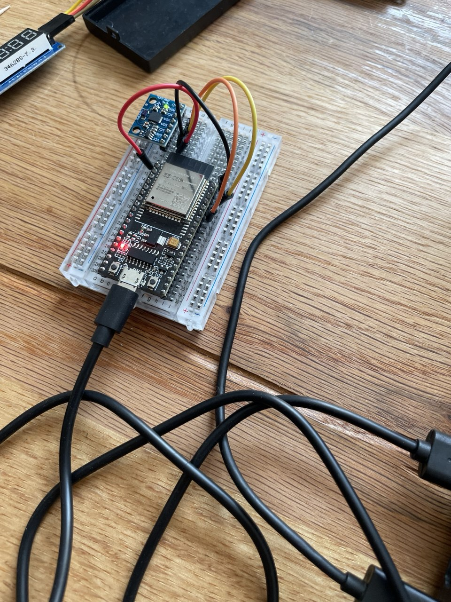
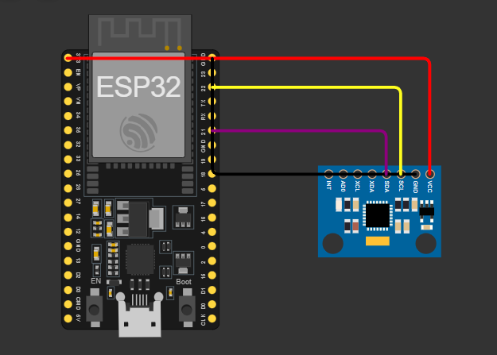

# IMU-Controlled Dino Game 🦖

A classic side-scrolling dinosaur game with a twist! Instead of using a keyboard, you control the character's jump by physically tilting an ESP32 with an MPU6050 Inertial Measurement Unit (IMU). A sharp upward tilt makes the dino jump high, while a gentle tilt results in a short hop.

This project demonstrates real-time sensor data processing, wireless communication over Wi-Fi, and interactive C# WPF application development.

## Demo Video
[](https://youtube.com/shorts/oR-sIzVkKSU)

---

## How It Works

The project consists of two main parts: the **ESP32 with the MPU6050 sensor** and the **WPF game application** running on a PC.

### ESP32 & MPU6050 Sensor Fusion

The ESP32 is the brain of the control system. It continuously reads raw data from the MPU6050, which contains a 3-axis accelerometer and a 3-axis gyroscope.

* **Gyroscope:** Excellent for measuring rotation, but it suffers from "drift" over time, meaning its sense of "level" will slowly wander.
* **Accelerometer:** Measures gravitational force, so it always knows which way is down. It's great for long-term stability but is very noisy and susceptible to errors from movement (acceleration).

To get the best of both worlds, we use a **Complementary Filter**. This is a sensor fusion algorithm that combines the gyroscope and accelerometer data.


In simple terms, the filter trusts the gyroscope for quick, short-term rotation changes and uses the accelerometer to correct any long-term drift. In this project's code, `alpha` is set to **0.98**, meaning the final angle is 98% from the integrated gyro reading and 2% from the accelerometer reading. This provides a stable and responsive pitch angle (`angleX`), which is then sent over Wi-Fi to the game.

### WPF Game Application

The C# WPF application acts as a TCP server, listening for a connection from the ESP32. Once connected, it:

1.  **Receives Angle Data:** It continuously reads the pitch angle data sent from the ESP32.
2.  **Detects Jump Action:** It calculates the *speed* of the pitch change. A quick upward change in the angle triggers a jump.
3.  **Calculates Jump Force:** The faster the tilt, the higher the initial jump velocity applied to the player character.
4.  **Runs the Game Loop:** It handles player physics (gravity), moves obstacles, checks for collisions, and updates the score.

---

## Requirements

### Hardware ⚙️

* ESP32 development board
* MPU6050 Gyroscope/Accelerometer module
* Jumper wires
* A Wi-Fi network

### Software 👨‍💻

* **Arduino IDE** with the ESP32 board manager installed.
* **Visual Studio 2022** 
* Required Arduino Libraries:
    * `Adafruit MPU6050`
---

## Setup & Installation

1.  **Hardware Connection:** Wire the MPU6050 to your ESP32.
    * `VCC` -> `3V3`
    * `GND` -> `GND`
    * `SCL` -> `GPIO 22` (ESP32's default SCL pin)
    * `SDA` -> `GPIO 21` (ESP32's default SDA pin)
  

  


2.  **ESP32 Setup:**
    * Open the ESP32 code in the Arduino IDE.
    * Install the required libraries from the Library Manager.
    * Update the Wi-Fi credentials in the code:
        ```cpp
        const char* ssid = "YOUR_WIFI_SSID";
        const char* password = "YOUR_WIFI_PASSWORD";
        ```
    * You will update the `host_ip` after running the WPF application.
    * Upload the code to your ESP32.

3.  **WPF Game Setup:**
    * Open the `IMU3D_MPU6050_WPF.sln` file in Visual Studio.
    * Build and run the project (press `F5`).
    * The application window will appear and display the IP address it's listening on (e.g., `Listening on 192.168.1.9:12345...`).

4.  **Connect Them:**
    * Go back to your Arduino code. Update the `host_ip` to the IP address shown in the game window.
        ```cpp
        const char* host_ip = "192.168.1.9"; // Use the IP from the WPF app
        ```
    * Re-upload the code to your ESP32.
    * Power on the ESP32. It should now connect to the game, and the status will change to "Client Connected!".

---

## How to Play

* The game starts automatically once the ESP32 is connected.
* **Tilt the MPU6050 sensor upwards to make the character jump.**
* A fast, sharp tilt will make it jump high. A slow, gentle tilt will result in a small hop.
* Avoid the obstacles! If you hit one, the game is over.
* Press the **'R' key** on your keyboard to restart after a game over.

---

## Contributing
Contributions are welcome. If you find a bug or have a feature request, please open an issue or submit a pull request.
